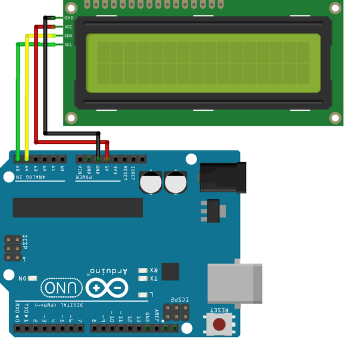

# LCD i2C

A tela é um LCD 16x2 (16 colunas e 2 linhas).

## Ligações

- O GND do módulo I2C deve ser conectado ao pino GND do Arduino;
- O módulo I2C opera com uma tensão de alimentação de 5V. Deste modo, conecte o VCC ao pino 5V do Arduino;
- Nas placas Arduino UNO, os pinos associados ao I2C são A4 (SDA) e A5 (SCL).
